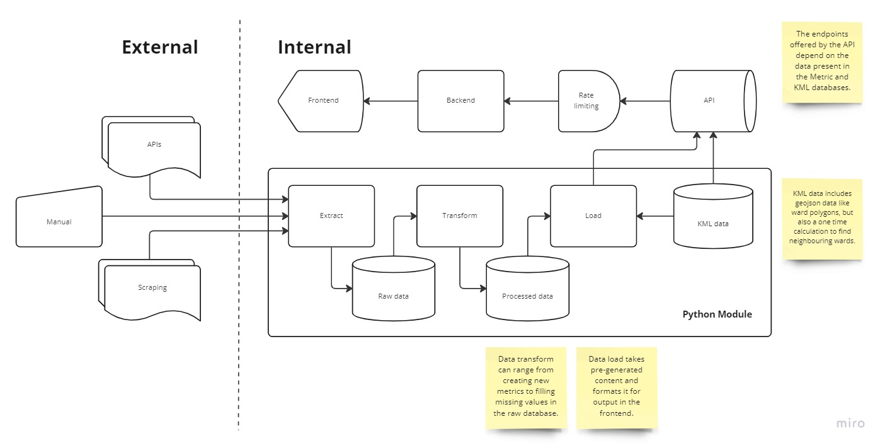

# Developer

This README contains instructions for setting up the developer environment, and is organised into three core folders which contain the following:

## Structure



## Installation

If you are using a Windows machine then set up [WSL2](https://learn.microsoft.com/en-us/windows/wsl/install) by running the following:

```
wsl.exe --install ubuntu
```

Open your user directory (in the Ubuntu partition for Windows devices) and clone the repo:

```
cd your/repo/directory
git clone https://github.com/edgorman/Property-Fundamentals
```

Run the `setup.sh` script to install python and npm:

```
./scripts/setup.sh
```

## Deployment

TODO
