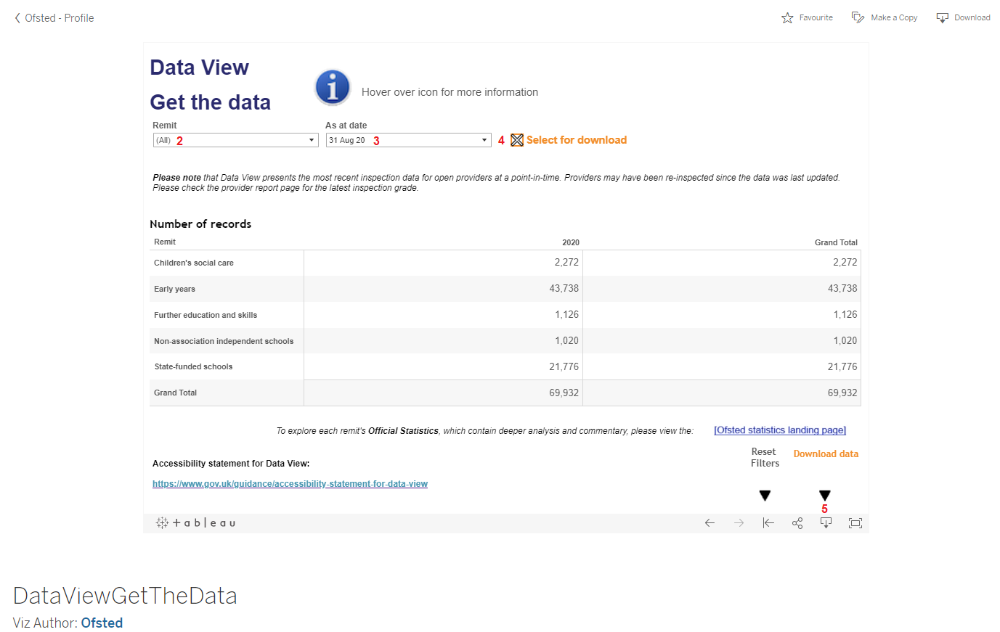
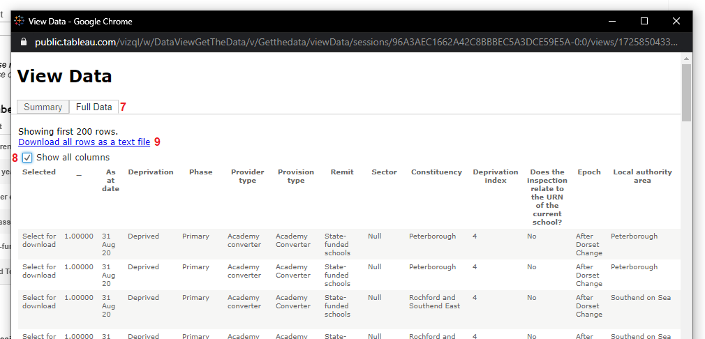

# Ofsted School Ratings

This readme is used for updating the Ofsted school ratings csv that is updated annually on the 30th of June and the 31st of August each year. However, sometimes this changes so check for it periodically.

## Download Instructions

1. Go to the [Data View: Get the data](https://public.tableau.com/profile/ofsted#!/vizhome/DataViewGetTheData/Getthedata) page.

2. Leave "Remit" as "(All)".

3. Change "As at date" to __only the most recent date__.

4. Enable the "Select for download" checkbox.

5. Click the "Download data" button in the bottom right.



6. Click the "Data" file format.


7. Click the "Full Data" tab at the top left.

8. Click the "Show Fields" button at the top right and select "All"

9. Click the "Download" button.



10. Overwrite the old csv stored in ```data/external/school_ratings/```

Well done! You've done what I thought automating would have been too much effort! :)